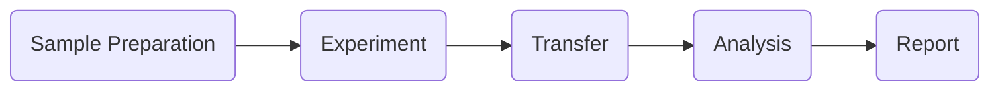
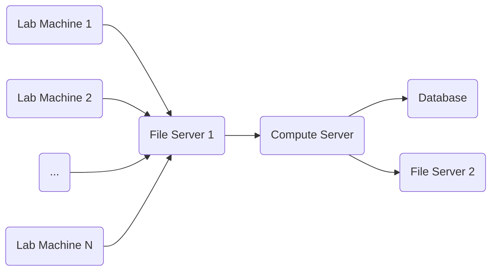
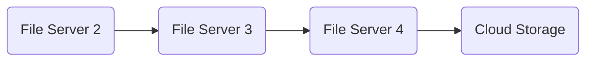

## Roswell Biotechnologies Signal Processing

Macklan Weinstein

---

# Molecular Electronics Chip

<div class="flex flex-col my-6">
  
  <div class="mt-1 text-xs mx-auto">Source: https://www.pnas.org/doi/10.1073/pnas.2112812119</div>
</div>

- Custom chip with 16K sensors for reading single molecule interactions.
- A molecular probe is attached to each sensor's electrode bridge to form an
  electrical circuit.
- Probe interactions with other molecules then become electrical currents.

---

# Algorithms

- Filter high frequency noise and remove baseline wander from electrical
  signals.
- Find pulses in filtered signals using one of two algorithms.
  - Cross Correlation algorithm built with [Numpy](https://numpy.org).
  - Hidden Markov Models algorithm built with
    [HMMLearn](https://hmmlearn.readthedocs.io).
- Calculate statistics for each pulse using [Scipy](https://scipy.org).
- Save pulse aggregates to database.

---

# Roswell Workflow

<div class="my-10 text-center">



</div>

- Signal processing team handled the analysis and report stages.
- Later began additionally handling the transfer stage.

---

# Analysis Stage

<div class="mt-10 text-center">



</div>

---

# RBTData Project

- Signal processing and software teams had difficulty reading experiment data in
  a timely manner.
- Experiment data was strewn across multiple locations and hard to find.
- Experiment data required heavy metadata parsing and custom code per experiment
  to understand any signal.

<v-click>

- I simplified data access down to a psuedo [Numpy](https://numpy.org) interface
  by creating a data access library called RBTData.

<br>

RBTData code example for user to access row 5, column 8 sensor data from column
all binding phases in expeiment JL-897.

```python
rbtdata.experiment("JL-897")["Binding.*"][5, 8, :]
```

Console output.

```
array([[[0, 1, 17, ...]]])
```

</v-click>

---

# MMA Project

- Each experiment was over 100GB of sensor data.
- Signal Processing team reports were a slideshow showing results from several
  experiments each week.
- Scientists wanted more in depth insight to the experiment data without having
  to learn software programming.
- I developed a web application, called MMA, built with
  [Streamlit](https://streamlit.io) and [Bokeh](https://bokeh.org) for the
  scientists.

<v-click>

<h4 class="font-extrabold my-6 text-center">MMA Features</h4>
<div class="max-w-xl mx-auto">

- Interactive sensor heatmap of aggregate signal statistics.
- Interactive signal plot for each sensor.
- Ability to rerun algorithms on selectable parts of the experiment.

</div>

 </v-click>

---

# MMA Issues

- Application was designed in _immediate mode_ rendering instead of _retained
  mode_ rendering.
- I chose an immediate mode design for lower code complexity and quicker feature
  iteration to improve developer retention.
- As application features increased, immediate mode design caused user
  interaction issues due to constant and expensive graph rendering.

<v-click>

<h4 class="font-extrabold my-6 text-center">Lessons Learned</h4>
<div class="max-w-xl mx-auto">

- Avoid prioritizing developer retention over end user experience.
- Always expect an application design to outgrow its planned features.
- Never use immediate mode for applications with scollbars!

</div>

 </v-click>

---

# Metabase Dashboard

- Workflow took 24 hours, but Roswell partner requires 30 minutes or less.
- Workflow involved many teams and needs coordination.
- I created a live searchable dashboard of experiment turnaround status using
  [Metabase](https://www.metabase.com).
- Dashboard provided live status for each workflow stage and supports aggregate
  analysis.
- Dashboard helped company to pinpoint bottlenecks in workflow.

<v-click>

- Company succeeded in reducing workflow to 30 minutes.

</v-click>

<div class="text-sm mt-8">

| Stage     | Experimenter      | Start                     | Finish                    | Error                              |
| --------- | ----------------- | ------------------------- | ------------------------- | ---------------------------------- |
| Uploading | Linus Pauling     | July 23, 2022 10:40:42 AM |                           | None                               |
| Computing | Dmitri Mendeleev  | July 23, 2022 10:30:14 AM |                           | Binding phase is missing sensor 35 |
| Complete  | Rosalind Franklin | July 23, 2022 10:20:10 AM | July 23, 2022 10:38:04 AM | None                               |

</div>

---

# GitLab CI/CD

- I developed teams' devops processes with
  [GitLab CI/CD](https://docs.gitlab.com/ee/ci) based on fork of my public
  project, [Scaffold Python](https://github.com/scruffaluff/scaffold-python).
- These processes supported builtin caching and testing for Linux, MacOS, and
  Windows.
- The processes supported SSH login for debugging.
- I developed automated [Docker Swarm](https://docs.docker.com/engine/swarm)
  deployments for teams' applications.
- I created company [package registry](https://docs.gitlab.com/ee/user/packages)
  and added CI/CD support for automatic Python package publishing.

---

# Data Retention

<div class="my-10 text-center">



</div>

- Company had several file servers organized by experiment date.
- Experiment data grew to exceed file servers' capacity.
- IT team would manually move experiments to older file servers every few weeks.
- I created cron jobs with Python programs to migrate experiments to other file
  servers and cloud storage every night.

---

# Questions

<div class="flex flex-col">
  
  <div class="mt-1 text-xs mx-auto">Source: https://www.greenleafips.com/portfolio-items/roswell-biotechnologies-moss-wall</div>
</div>
